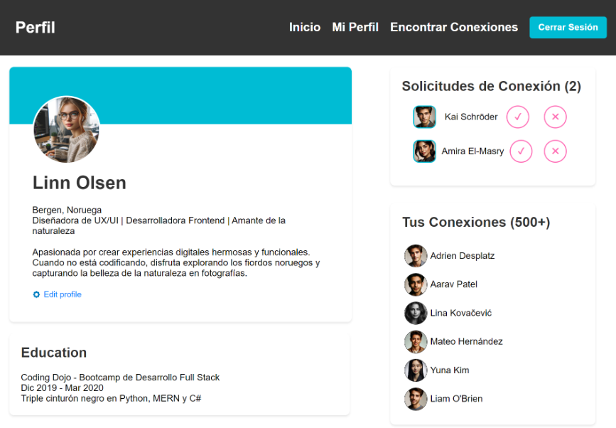

# 🌐 Maquetación de Perfil - Ejercicio Individual

Este repositorio contiene una práctica de maquetado con HTML y CSS como parte del bootcamp **Full Stack Python Trainee**, dictado por [Skillnest](https://learning.skillnest.com). El objetivo del ejercicio es recrear una página de perfil visualmente similar a un diseño proporcionado, desarrollando desde cero la estructura HTML y su respectivo estilo en CSS.

---

## 🎯 Objetivos del ejercicio

- Practicar la construcción de una página web utilizando HTML y CSS.
- Aplicar conceptos de maquetación moderna: **flexbox**, **alineaciones**, márgenes, paddings y estructuras semánticas.
- Desarrollar la página **de arriba hacia abajo** y **de afuera hacia adentro**, como estrategia de diseño.
- Mejorar habilidades visuales y atención al detalle en el diseño web.

> ⚠️ **Nota:** En esta etapa del ejercicio no se requería que la página fuera responsiva.

---

## 🧰 Tecnologías utilizadas

- **HTML5** – Estructura del contenido
- **CSS3** – Diseño visual
- [Visual Studio Code](https://code.visualstudio.com/) – Editor de código
- **Git y GitHub** – Control de versiones y publicación del proyecto

---

## 🖼️ Diseño de referencia

A continuación, una captura de la interfaz que se pidió replicar:



> Fuente: Skillnest – Bootcamp Full Stack Python Trainee

---

## 📂 Estructura del proyecto

```txt
maquetacion-perfil/
│
├── index.html              # Página principal
├── README.md               # Documentación del proyecto
└── assets/
    ├── style.css               # Estilos CSS
    └── img/
        └── perfil-referencia.png  # Imagen de referencia visual
```

---

## 🚀 Cómo clonar y ejecutar este proyecto

1. Clona este repositorio:

```bash
git clone https://github.com/EstefanyRodriguezP/maquetacion-perfil.git
```

2. Abre el archivo `index.html` directamente en tu navegador, o usa Live Server desde VS Code para verlo en tiempo real.

---

## ✅ Estado del proyecto

✅ Maquetación completada  
✅ Estilos replicados visualmente  
⚠️ Sin responsividad (no era parte del requerimiento)  
⏱ Tiempo estimado de desarrollo: ~4 horas  
👤 Desarrollado individualmente

---

## 🌱 Posibles mejoras

- Hacer el diseño responsive con media queries
- Incorporar transiciones o efectos en hover
- Usar un sistema de componentes con algún framework CSS como Tailwind (en futuros proyectos)
- Mejorar accesibilidad con etiquetas semánticas y contraste de colores

---

## ✍️ Autor

Desarrollado por **Estefany Rodríguez** como parte del bootcamp Full Stack Python Trainee.

- GitHub: [EstefanyRodriguezP](https://github.com/EstefanyRodriguezP)

---

> 💡 _“Diseñar con CSS no es solo cuestión de código, sino de saber leer visualmente una interfaz.”_
